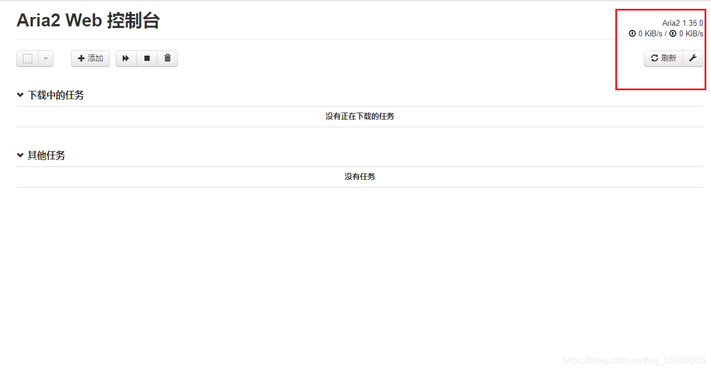
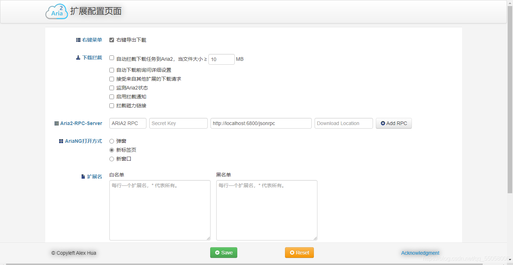

### Aria2 安装和使用全教程

+ [Aria2介绍](#Aria2_2)+ 
+ [下载](#_5)+ [安装](#_12)+ [小结](#_23)+ [Web端配置教程](#Web_28)+ [使用](#_41)+ [AriaNg](#AriaNg_53)+ [Aria2扩展](#Aria2_58)

# Aria2介绍

Aria2是一个命令行下载器，相比于迅雷、IDM、比特彗星，Aria2拥有众多的————缺点，不过，还是有一些地方能用到它，比如百度网盘下载（我不会介绍百度网盘下载加速方法）。

## 下载

首先，打开[Aria2官网](http://aria2.github.io/)，可以看到中间有一个名为“version 1.35.0”的字样，点击它，就可以进入Aria2的下载页面了。 

 而后跳转到了一个GitHub的发布页面，网站加载可能有点慢，大家需要耐心等待，滑到底部，看到下载列表，点击下载即可 

## 安装

下载完成后是一个压缩包，解压完成后是个文件夹，里面的文件如图所示 

 我们给它改个名字（也可以不改），放到自己喜欢的地方，我这里为了方便，就直接放C盘了。 

 接下来需要添加环境变量，这个步骤是为了让aria2可以在命令行运行，如果你只想使用Web端来进行控制，也可以选择不添加，不过不乏有一些极客想使用命令行，所以还是建议你看一下，当然也可以跳过。 

 打开文件夹，复制上方的路径，然后右键桌面上的“此电脑”，选择“属性”，在弹出的窗口中单击“高级系统设置”（如果没有可以向下滑动鼠标），再在弹出的窗口中点击“环境变量”，再在弹出的窗口中双击“Path” 

 双击“Path”后，看到如下图像，点击右边的“新建”，然后在文本框中填入刚才复制的Aria2路径，接着一路确定退出就可以了。 

## 小结

其实，到目前为止，Aria2已经可以正常使用了，你只需要打开命令提示符，输入`aria2c 下载地址`就可以开始下载文件了，不过现在还只能在命令行中使用，接下来是为了使用Web端控制的配置教程。 

## Web端配置教程

点击[这个下载链接](https://aria2c.com/archiver/aria2.zip)，解压下载的压缩包后，把里面的aria2.exe、aria2.conf、aria2.session三个文件复制到原先Aria2的安装文件夹里，然后用记事本打开aria2.conf，你会看到一大堆的文字，别担心，我们只修改其中的一两个配置。

把`dir=Aria2Data`中的Aria2Date修改成自己喜欢的下载路径，注意，如果路径填错了，是不能正常下载文件的！

把`max-connection-per-server=5`中的数字5修改成16，这个设置是为了提升下载速度，最大数值为16，可以自己选择

把`split=5`中的数字5修改成自己想要的数字，同样是为了加快下载速度，这一行用来设置文件的分片数量，数值没有上限，一般16-32就够了

完成这些后，保存退出，配置就完成了。

**`很重要的声明`**：以上的这些配置包括aria2.conf中的所有配置，都只会在接下来的Web控制端中生效，不会再命令行下载中生效，对于命令行的使用是没有一点用处的！希望大家避开这个坑。

## 使用

双击Aria2安装文件夹中的aria2.exe来启动Aria2，右下角应该会出现它的图标，现在我们进入这个网址[http://aria2c.com/](http://aria2c.com/)，这是Aria2的Web控制端，可以比较方便的管理下载任务。

我们可以看到右上角显示着当前aria2的版本号和下载速度，注意：只有启动了aria2.exe后才可以正常的使用Web控制端，否则不会显示。 

 单击左边的新建，来添加第一个下载任务. 

 简单的填写信息后，就可以点击添加开始下载了，因为进行了配置，所以有一些信息自动为我们进行了填写。

接下来，我们可以尝试使用一些更高级的Web控制端。

## AriaNg

打开[这个页面](https://github.com/mayswind/AriaNg/releases)，点击下载列表中的“AriaNg-1.2.1-AllInOne.zip”进行下载，解压下载的压缩包，可以看到里面有一个名为“index.html”的文件，双击它，可以看到以下画面 

 它的操作方法与上面介绍的Web控制端大同小异，而且功能还更多，大家可以自己去探索。

## Aria2扩展

每次要用Aria2下载文件的时候，总是要复制下载链接，然后粘贴到别的地方才能进行下载，显得很麻烦。使用浏览器扩展，可以很方便的解决这个问题。进入浏览器自带的扩展商店，搜索aria2，一般可以看到这个扩展 

 安装之后，进行一些简单的配置，就可以实现“右键导出下载”，“自动拦截下载任务”等功能了，这里就不过多赘述了 

 可以看到，功能还是很多的。 不过，这一切的大前提是，aria2.exe保持运行状态，如果一不小心手贱关掉了，就不能正常使用Web控制端了，需要重新打开。

完。

