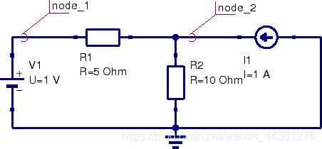

 

### 文章目录

+ [Modified Nodal Analysis](#Modified_Nodal_Analysis_10)+ [一、Generating the MNA matrices](#Generating_the_MNA_matrices_54)+ 
+ [The A matrix](#The_A_matrix_56)+ 
+ 
+ [Rules for making the G matrix](#Rules_for_making_the_G_matrix_67)+ [Rules for making the B matrix](#Rules_for_making_the_B_matrix_72)+ [Rules for making the C matrix](#Rules_for_making_the_C_matrix_75)+ [Rules for making the D matrix](#Rules_for_making_the_D_matrix_77)

+ [The x matrix](#The_x_matrix_79)+ 
+ 
+ [Rules for making the v matrix](#Rules_for_making_the_v_matrix_89)+ [Rules for making the j matrix](#Rules_for_making_the_j_matrix_95)

+ [The z matrix](#The_z_matrix_100)+ 
+ 
+ [Rules for making the i matrix](#Rules_for_making_the_i_matrix_109)+ [Rules for making the e matrix](#Rules_for_making_the_e_matrix_111)

+ [二、A simple example](#A_simple_example_114)+ 
+ [Going through the MNA algorithm](#Going_through_the_MNA_algorithm_117)+ [How the algotithm relates to basic equations in circuit analysis](#How_the_algotithm_relates_to_basic_equations_in_circuit_analysis_160)

# Modified Nodal Analysis

 在网络分析中，会遇到不同类型的网络元件。对于电路分析，有必要为包含尽可能多的网络建立方程。建立电路的方程组有多种方法，但他们主要基于电路理论的三种方法： 

+ 基尔霍夫电压定律（KVL）+ 基尔霍夫电流定律（KCL）+ 分支结构方程（branch constitutive equations）

方程必须以简单、全面的方式自动地表述（用计算机程序表示）。一旦公式化，方程组就必须求解。在以此为目的选择算法时，需要考虑两个主要方面：精度和速度。简单地说，**M**odified **N**odal **A**nalysis已经被证明可以完成这些任务。

MNA用于仅包含无源元件，有源元件，独立电压源、电流源可以写成矩阵等式形式： 

$$
[A] \cdot[x]=[z]
$$

 对于一个包含N个节点与M个独立电压源的电路：

+ A 矩阵 
  
+ 矩阵维度为 $(\mathrm{N}+\mathrm{M}) \times(\mathrm{N}+\mathrm{M})$，并且只包含已知量+ $\mathrm{N} \times \mathrm{N}$部分在矩阵的左上角： 
    
+ 仅包含无源元件+ 接地的原件仅出现在对角线上+ 不接地的原件既出现在对角线上，也存在于矩阵的其他位值
 + A矩阵的剩余部分（即N*N部分以外）仅包含1，-1，0（这些值取决于该位置的独立电压源和电流源）
 + x矩阵 
  
+ 是一个$(\mathrm{N}+\mathrm{M}) \times 1$的向量，包含未知量，包括节点电压与流入电压源的电流+ 上面的N个元素是节点电压+ 下面M个元素是流入电压源的电流
 + z矩阵 
  
+ 是一个$(\mathrm{N}+\mathrm{M}) \times 1$的向量，仅包含已知量+ 上面N个元素是电路中独立电流源+ 下面M个元素是电路中独立电压源
 

电路通过简单的矩阵运算求解： 

$$
[x]=[A]^{-1} \cdot[z]
$$

 这种方法可能很难通过人工计算，但计算机会容易得多。 

 

# 一、Generating the MNA matrices

接下来的部分是通过算法实现MNA。一共需要生成三个矩阵，**A**、**x**和**z**，每个矩阵都是由数个独立的矩阵组合而成。

## The A matrix

**A**矩阵由四个矩阵（**G**、**B**、**C**和**D**）组合而成。 

$$
[A] = \begin{bmatrix} G & B \\ C & D \end{bmatrix} \quad
$$

 **A**矩阵是$(\mathrm{N}+\mathrm{M}) \times(\mathrm{N}+\mathrm{M})$（N是节点的个数，M是独立电压源的个数）：

+ G矩阵是$\mathrm{N} \times \mathrm{N}$，由电路原件之间相互连接决定+ B矩阵是$\mathrm{N} \times \mathrm{M}$，由独立电压源的连接关系决定+ C矩阵是$\mathrm{M} \times \mathrm{N}$，由独立电压源的连接关系决定（B和C是密切相关的，特别是当只考虑独立来源时）+ D矩阵是$\mathrm{M} \times \mathrm{M}$，当仅考虑独立（电压/电流）源时为**零**矩阵

#### Rules for making the G matrix

G矩阵是$\mathrm{N} \times \mathrm{N}$，可由两步生成。

+ 矩阵中对角线上的每个元素等于相应节点上相连的电路元件的电导（电阻的倒数）之和。因此，对角线上的第一个元素是与节点1直接相连的电导之和，对角线上的第二个元素是与第二个节点直接相连的电导之和，以此类推。+ 非对角线上的元素是每对节点之间的负电导值。因此，节点1和2之间的电导需要放入到G矩阵的$(\mathrm{1},\mathrm{2})$和$(\mathrm{2},\mathrm{1})$。 如果原件直接接地，那么在G矩阵中，该原件仅出现在一个位置上（在对角线上的适当位置）。如果原件没有接地，那么在G矩阵中，该原件将出现在四个位置上（对角线上的两个位置（相对应的两个节点上）和非对角线上的两个位置）。

#### Rules for making the B matrix

B矩阵是$\mathrm{N} \times \mathrm{M}$，且仅由0，1和-1组成。矩阵中每个位置对应一个指定的电压源（第一个维度）或节点（第二个维度）。如果第i个电压源的正端与节点k相连，则B矩阵的元素$(\mathrm{k} \times \mathrm{i})$是1，如果第i个电压源的负端与节点k相连，则B矩阵的元素$(\mathrm{k} \times \mathrm{i})$是-1，否则，为0。 如果电压源未接地，则在B矩阵中出现两次（在同一列中出现一个1和一个-1）。如果电压源接地，则仅会在矩阵中出现一次。

#### Rules for making the C matrix

C矩阵是B矩阵的转置。当存在非独立源时，则不是这种关系。

#### Rules for making the D matrix

D矩阵是$\mathrm{M} \times \mathrm{M}$，为全零阵。当存在非独立源时，则不是全零阵。

## The x matrix

x矩阵包含我们的未知量，并且将被发展为两个较小的矩阵v和j的组合。它比A矩阵更容易定义。 

$$
[x] = \begin{bmatrix} v \\ j \end{bmatrix} \quad
$$

 x矩阵是$(\mathrm{N}+\mathrm{M}) \times 1$（N是节点数，M是独立电压源数）

+ v矩阵是$\mathrm{N} \times 1$,包括N个节点的电压值+ j矩阵是$\mathrm{M} \times 1$,包含M个**流入**电压源的电流值

#### Rules for making the v matrix

v矩阵是$\mathrm{N} \times 1$，由节点电压构成。v中的每个元素对应于电路中等效节点处的电压（接地-节点0没有输入）。 对于具有N个节点的电路，我们可以得到： 

$$
[v] = \begin{bmatrix} v_1 \\ v_2 \\.\\.\\.\\ v_n \end{bmatrix}
$$

#### Rules for making the j matrix

j矩阵是$\mathrm{M} \times 1$，每个电压源有一个电流输入。因此，如果有M个电压源$V_1$、$V_2$一直到$V_M$，$j$矩阵将是： 

$$
[j] = \begin{bmatrix} i_{v_1} \\ i_{v_2} \\.\\.\\.\\ i_{v_n} \end{bmatrix}
$$

## The z matrix

z矩阵包含独立的电压源和电流源，并且有两个小矩阵**i**和**e**构成： 

$$
[z] = \begin{bmatrix} i \\ e \end{bmatrix}
$$

 z矩阵是$(\mathrm{N}+\mathrm{M}) \times 1$(N是节点数，M是独立电压源的个数)

+ i矩阵是$\mathrm{N} \times 1$，包含通过无源元件进入相应节点的电流总和（零或独立电流源之和）+ e矩阵是$\mathrm{M} \times 1$，保存独立电压源的值

#### Rules for making the i matrix

i矩阵是一个$\mathrm{N} \times 1$矩阵，矩阵的每个元素对应于一个特定的节点。i的每个元素的值由进入相应节点的电流源的总和确定。如果没有电流源连接到节点，则该值为零

#### Rules for making the e matrix

e矩阵是一个$\mathrm{M} \times 1$矩阵，矩阵的每个元素的值与相应的独立电压源相等 

# 二、A simple example

图3.1中给出的示例说明了建立MNA矩阵的规则的应用，以及这与电路分析中使用的基本方程的关系。 

## Going through the MNA algorithm

G矩阵是$\mathrm{2} \times \mathrm{2}$，因为除ground作为参考节点外，仍有两个独立节点。在对角线上，可以找到连接到节点1和节点2的元素和导体的总和。非对角矩阵项包含两个节点之间连接的元素的负电导。 

$$
G = \begin{bmatrix} 1/R_1 & -1/R_1 \\ -1/R_1 & 1/R_1+1/R_2 \end{bmatrix} = \begin{bmatrix} 0.2 & -0.2 \\ -0.2 & 0.3 \end{bmatrix}
$$

 B矩阵（C为B的转置）是$\mathrm{1} \times \mathrm{2}$，因为包含一个电压源和两个节点。电压源$V_1$的正端与节点1相连，所以 

$$
B = C^T = \begin{bmatrix} 1 \\ 0 \end{bmatrix}
$$

 D矩阵为全零阵，因为电路中没有有源器件与受控源。 

$$
D = \begin{bmatrix} 0 \end{bmatrix}
$$

 x矩阵为$\mathrm{1} \times \mathrm{3}$。MNA方程给出了电路中除参考节点外的每个节点的未知电压和通过每个电压源的电流的解。 

$$
x = \begin{bmatrix} v_1 \\ v_2 \\ i_{V_1}\end{bmatrix}
$$

 z矩阵是根据规则构建的$\mathrm{1} \times \mathrm{3}$的矩阵。上面两个元素是流入节点1和节点2的电流总和。下面的元素是电压源的电压源$V_1$。 

$$
z = \begin{bmatrix} 0 \\ I_1 \\ U_1\end{bmatrix} = \begin{bmatrix} 0 \\ 1 \\ 1\end{bmatrix}
$$

 根据MNA算法，等式可以表示为 

$$
[A] \sdot [x] = [z]
$$

 等价于 

$$
\begin{bmatrix} G & B \\ C & D\end{bmatrix} \sdot [x] = [z]
$$

 根据上式可以扩展为 

$$
\begin{bmatrix} 1/R_1 & -1/R_1 & 1 \\ -1/R_1 & 1/R_1+1/R_2 & 0 \\ 1 & 0 & 0\end{bmatrix} \sdot \begin{bmatrix} v_1 \\ v_2 \\ i_{V_1}\end{bmatrix} = \begin{bmatrix} 0 \\ I_1 \\ U_1 \end{bmatrix}
$$

 要求解的方程组现在由以下矩阵表示法定义。 

$$
\begin{bmatrix} 0.2 & -0.2 & 1 \\ -0.2 & 0.3 & 0 \\ 1 & 0 & 0\end{bmatrix} \sdot \begin{bmatrix} v_1 \\ v_2 \\ i_{V_1}\end{bmatrix} = \begin{bmatrix} 0 \\ 1 \\ 1 \end{bmatrix}
$$

 利用矩阵转置求解向量x 

$$
[x] = [A]^-1 \sdot [z] = \begin{bmatrix} v_1 \\ v_2 \\ i_{V_1}\end{bmatrix} = \begin{bmatrix} 1 \\ 4 \\ 0.6\end{bmatrix}
$$

 式中的结果表示通过电压源的电流为0.6A，节点1处的电压为1V ，节点2处的电压为4V。

## How the algotithm relates to basic equations in circuit analysis

将式中的矩阵表示法扩展为一组方程，可由以下由3个方程组表示。 I: $\quad 0=\frac{1}{R_{1}} \cdot v_{1}-\frac{1}{R_{1}} \cdot v_{2}+i_{V_{1}} \quad$ KCL at node 1 II: $\quad I_{1}=-\frac{1}{R_{1}} \cdot v_{1}+\left(\frac{1}{R_{1}}+\frac{1}{R_{2}}\right) \cdot v_{2} \quad$ KCL at node 2 III: $\quad U_{1}=v_{1} \quad$ constitutive equation 显然，方程I和方程II在节点1和节点2处符合基尔霍夫电流定律。最后一个方程就是电压源的本构方程。有三个未知数$(v_1，v_2和i_{V_1})$和三个方程，因此系统应该是可解的。 等式III表示节点1处的电压为。将此结果应用于等式II并将其转置到（节点2处的电压）得到 

$$
v_{2}=\frac{I_{1}+\frac{1}{R_{1}} \cdot U_{1}}{\frac{1}{R_{1}}+\frac{1}{R_{2}}}=4 \mathrm{~V}
$$

 通过电压源的电流可以使用结果和转换方程I来计算。 

$$
i_{V_{1}}=\frac{1}{R_{1}} \cdot v_{2}-\frac{1}{R_{1}} \cdot v_{1}=0.6 \mathrm{~A}
$$

 如图所示的小例子，以及将推理转化为无技巧的数学验证了MNA算法和经典的电气手工往往会产生相同的结果

